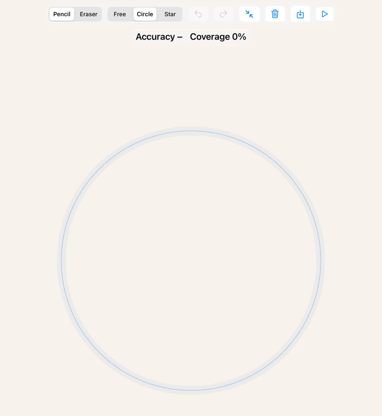
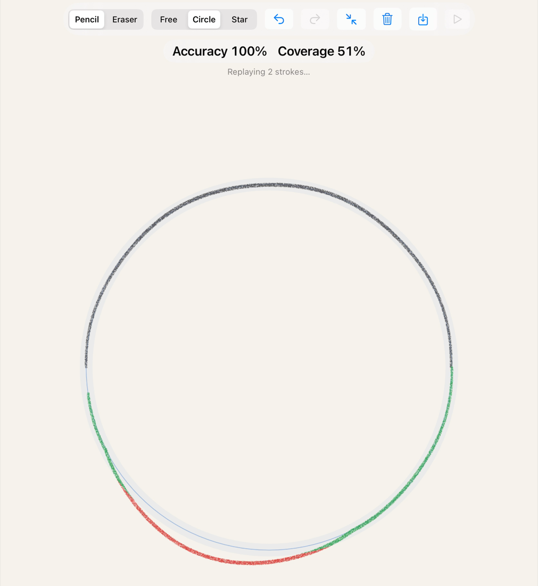
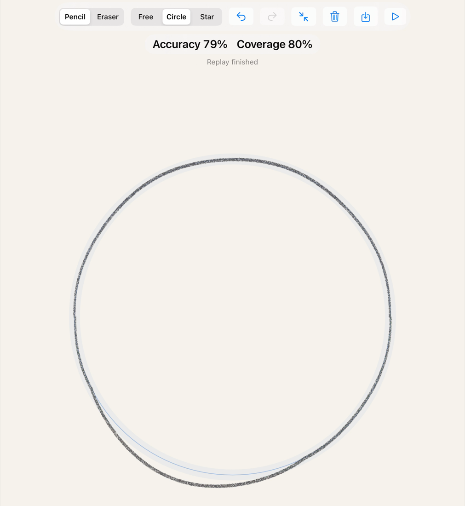
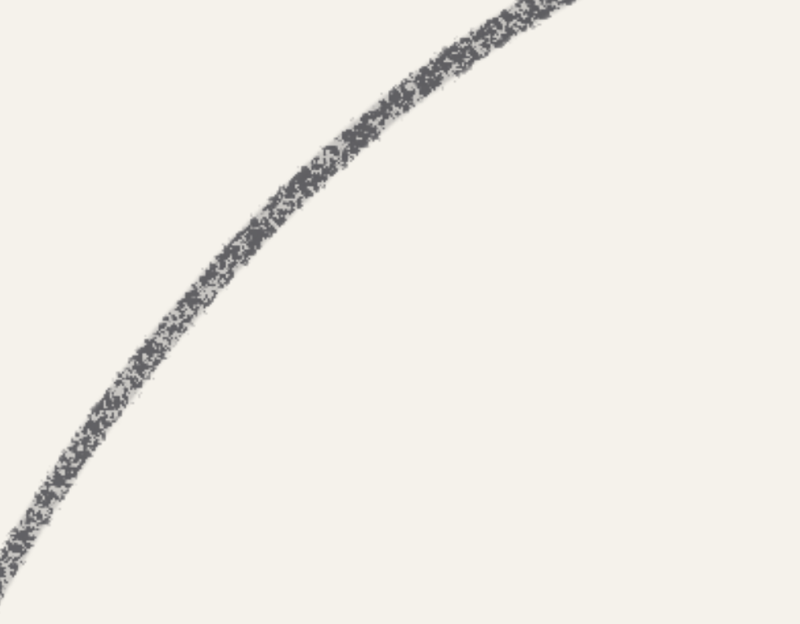
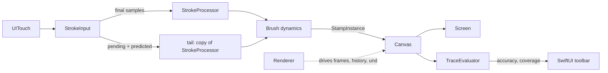

# MetalCanvas

A drawing canvas for iPad built directly on **Metal**: pencil brushes for Apple Pencil and
a **tracing check** that tells the learner how accurately a shape was traced — the core loop of a
drawing-lessons app. No third-party dependencies; SwiftUI shell, `MTKView` canvas.

  

| Live highlight while tracing | Result after the strokes | Pencil grain up close |
|---|---|---|
|  |  |  |

*Captured in the iPad simulator from a replayed stroke recording.*

## Features

- **Pencil brush**: stamp-based with instancing; pressure → size and opacity, tilt → size; graphite
  settles on the paper tooth (a canvas-space height map), so light strokes are grainy and edges ragged.
- **Brushes are data**: presets are JSON (`Brushes/pencil.json`, `Brushes/eraser.json`); textures are
  generated in code.
- **Apple Pencil input**: coalesced touches (240 Hz), predicted touches for lower latency,
  estimated force/tilt updates applied without adding latency, double tap to toggle the eraser.
- **Smooth strokes**: centripetal Catmull-Rom through every sample, stamps at an even spacing of
  8% of the diameter.
- **Eraser, zoom and pan** (1–8×, pinch around the fingers, two-finger pan while the Pencil keeps drawing),
  **undo/redo** (buttons, two- and three-finger taps).
- **Tracing check**: circle or star outline, tolerance band, live green/red highlight, **accuracy** and
  **coverage** computed on the GPU.
- **Record and replay** strokes as JSON, with pixel-identical results on any screen.

## Architecture

| File | Responsibility |
|---|---|
| `Renderer` | Device, command queue, frame loop; the single stroke path used by live input, replay, undo and redo; history and checkpoints |
| `Canvas` | Canvas, stroke and prediction textures; stamp, merge, erase and display pipelines; checkpoint blits |
| `StrokeInput` | `UITouch` → `InputSample` (canvas pixels, force, altitude, azimuth); coalesced/predicted touches; estimated property updates |
| `StrokeProcessor` | Centripetal Catmull-Rom + arc-length resampling → `StampPoint`s (a `struct`, cheap to copy) |
| `Brush`, `BrushTextures` | Codable preset and its dynamics; procedurally generated shape and paper textures |
| `StampBufferRing` | Triple-buffered instance storage guarded by a semaphore |
| `TraceEvaluator`, `TraceTarget` | Distance field and accuracy/coverage compute kernels; target outlines |
| `CanvasLayout` | Fit/zoom/pan, the 3×3 quad transform and the inverse mapping for touches |
| `StrokeRecording` | JSON recording format and storage |
| `CanvasView`, `MetalCanvasView`, `CanvasController`, `ContentView` | `MTKView` subclass with gestures and Pencil interaction; SwiftUI bridge (`@Observable`) and toolbar |
| `Shaders.metal`, `ShaderTypes.h` | All shaders; structs shared by Swift and MSL (bridging header) |

### A frame on the GPU

One command buffer per frame, encoded in this order:

1. **Canvas clear or checkpoint restore** (blit), when requested.
2. **Stroke stamps → stroke texture** — one instanced draw for all new stamps (`.load`, keeps growing).
3. **Tail stamps → prediction texture** — pending and predicted samples, rebuilt from scratch every frame.
4. **Merge** — on lift-off the stroke texture is composited into the canvas once (paint or erase blending).
5. **Checkpoint save** (blit) every 20 strokes.
6. **Trace metrics** — two compute kernels read the canvas after the merge.
7. **Screen** — guide, canvas, and the live stroke preview (`max(stroke, tail)`, tinted when tracing).

The view redraws on demand (`isPaused = true`, `enableSetNeedsDisplay = true`).

### Memory

| Texture | Format | Size |
|---|---|---|
| Canvas 2048² | `bgra8Unorm` | 16 MB |
| Current stroke | `r8Unorm` (coverage only) | 4 MB |
| Predicted tail | `r8Unorm` | 4 MB |
| Undo checkpoint (created on first use) | `bgra8Unorm` | 16 MB |
| Distance field 1024² (while tracing) | `r16Float` | 2 MB |
| Brush textures, instance buffers | — | < 0.2 MB |

About **42 MB** of GPU memory in total — comfortable on the 4 GB iPad Pro 2018 (A12X, Metal family Apple5)
the project targets.

## Design decisions

**Stamps with instancing.** A stroke is a series of textured quads. All stamps of a frame go into one
instanced draw call, their parameters in a shared `MTLBuffer`. A ring of three buffers and a semaphore
keep the CPU from overwriting data the GPU is still reading.

**Stroke texture: flow inside, opacity once.** The current stroke accumulates *coverage* in a single-channel
texture and is merged into the canvas once, with color × opacity. Overlaps within one stroke never darken
beyond the stroke's opacity; separate strokes still layer like real pencil. The blend inside the stroke is a
preset option: `max` (pencil: a tap is visible, pressure maps straight to opacity) or `over` (paint-like
build-up). With ~12 stamps overlapping each pixel, `over` saturates quickly — that is why the pencil uses `max`.

**Graphite on a paper height map.** Grain is not a multiplier: the paper texture is a histogram-equalized
height map in canvas space, and graphite covers bumps above `1 − shape × alpha`. Light pressure leaves
sparse specks, firm pressure fills in, edges come out ragged, and the grain stays fixed to the paper.
Multiplying by noise looked like grey dust.

**Low latency without wrong pixels.** A copy of the stroke processor (a `struct`) is extended with the
predicted samples and the samples still waiting for Pencil force updates; that tail is drawn into its own
texture every frame and never merged. Only final samples reach the stroke texture, so the finished stroke
uses the real force and tilt, and latency stays the same.

**Recordings and undo are the same thing.** Every finished stroke is kept as input (samples, a brush
snapshot, the points-to-pixels factor at stroke start). Replay feeds the samples through the same path as
live input; jitter is a hash of the stamp index, so results are pixel-identical. Undo restores a blit
checkpoint (every 20 strokes, one 16 MB texture) and redraws the strokes after it; redo draws one stroke.

**Tracing metrics from the canvas itself.** A compute kernel builds a distance field of the outline once
per target. Accuracy = drawn pixels within tolerance / drawn pixels; coverage = outline samples with paint
nearby / outline samples; both via atomic counters. Measuring pixels rather than stroke points means
erasing and undo are taken into account automatically.

**Premultiplied alpha everywhere**, a transparent canvas over a paper-colored clear (so the eraser reveals
the paper), a fixed 2048² canvas independent of the screen, and `supportsFamily` checks where features
differ (`dispatchThreads` needs Apple4+; the simulator falls back to `dispatchThreadgroups`).

## Running

- Xcode 26 or later, iPadOS 17+ (iPad only). The Metal compiler is a separate component since Xcode 26:
  `xcodebuild -downloadComponent MetalToolchain`.
- Open `MetalCanvas.xcodeproj` and run on an iPad or the iPad simulator. In the simulator, pressure is
  emulated from speed.
- **Save** writes the strokes on the canvas to `Documents` (visible in the Files app); **Replay** plays the
  most recent recording at its original pace.
- The console logs per-stroke stats: stamps, draw calls, frame interval, touch-to-glass latency,
  estimated-property updates.
- Experiment flags: `Renderer.usePrediction`, `Renderer.renderContinuouslyWhileDrawing`,
  `StrokeInput.simulateEstimatedUpdates`.

## Hard parts

- **UIKit event order**: a gesture's action fires before its touches are cancelled, so a two-finger-tap undo
  was rejected by an "in the middle of a stroke" guard. The view now cancels the finger stroke first.
- **Coverage saturation**: with ~12 stamps per pixel, visible taps and pressure-controlled opacity are
  incompatible under `over` blending — solved with a `max` blend mode per preset.
- **Pencil look**: noise multiplication looked like dust; a thresholded paper height map looks like graphite.
- **Swift ↔ MSL layout**: `NS_ENUM` is 8 bytes in Swift and 4 in Metal, so struct fields use `int`;
  `float4` alignment and `float3x3` column padding are handled in `ShaderTypes.h`.
- **Frame races**: a stroke ending and a new one starting before the merge was encoded; undo right after a
  checkpoint was scheduled but not yet copied. Both are flushed explicitly.
- **Swift 6 and Metal callbacks**: completion and presented handlers run on Metal's threads; they capture only
  sendable values and hop to the main actor.
- **Simulator gaps**: no Pencil, no `addPresentedHandler`, no Apple GPU family. Pressure is emulated,
  latency falls back to GPU completion time, compute dispatch falls back to whole threadgroups.

## What's next

- Color picker and more brush presets.
- Mipmapped canvas for zooming out below the fitted size.
- Gradient noise for the paper texture (value noise can look blocky at high zoom).
- Arbitrary target shapes (jump flooding instead of brute-force segment distances).
- Saving and loading drawings.

---

*This code is published for review only. No license is granted; all rights reserved.*
